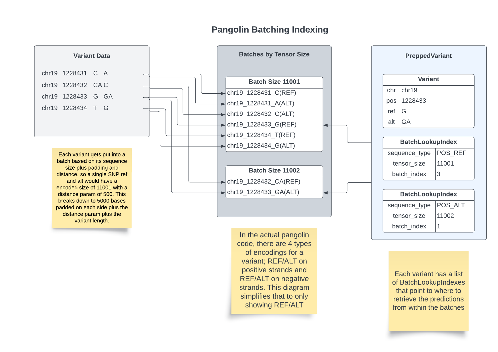

# Pangolin

Pangolin is a deep-learning based method for predicting splice site strengths (for details, see [Zeng and Li, Genome Biology 2022](https://doi.org/10.1186/s13059-022-02664-4)). It is available as a command-line tool that can be run on a VCF or CSV file containing variants of interest; Pangolin will predict changes in splice site strength due to each variant, and return a file of the same format. Pangolin's models can also be used with custom sequences.

Original Pangolin source can be run on Google Colab, which provides free acess to GPUs and other computing resources: https://colab.research.google.com/github/tkzeng/Pangolin/blob/main/PangolinColab.ipynb

See below for information on usage and local installation.

### Installation
* Prerequisites: Python 3.8 or higher
* Poetry: See https://python-poetry.org/docs/#installation
* Install Pangolin:
  ```
  git clone https://github.com/invitae/Pangolin.git
  cd Pangolin
  poetry install
  ```
* Activate env
  ```
  poetry shell
  ```

### Usage (command-line)

1. Create an annotation database from a GTF file using `scripts/create_db.py`. This will take several minutes. By default, it looks for the Ensembl_canonical tag to identify a primary transcript for each gene. Example usage:
   ```
   python scripts/create_db.py gencode.v38lift37.annotation.gtf.gz
   # output: gencode.v38lift37.annotation.db
   ```

   Annotation databases for GENCODE Release 38 (released 5/5/21) can be downloaded from: https://www.dropbox.com/sh/6zo0aegoalvgd9f/AADWN_cGIWpvVN9BYJ37vGmZa?dl=0
   * `gencode.v38.annotation.db`: GENCODE gene annotations for GRCh38 for transcripts with the Ensembl_canonical tag
      ```
      # download annotation file
      wget https://www.dropbox.com/sh/6zo0aegoalvgd9f/AADOhGYJo8tbUhpscp3wSFj6a/gencode.v38.annotation.db
      ```
   * `gencode.v38lift37.annotation.db`: GENCODE gene annotations for GRCh38 (lifted to GRCh37) for transcripts with the Ensembl_canonical, appris_principal, appris_candidate, or appris_candidate_longest tags
      ```
      # download annotation file
      wget https://www.dropbox.com/sh/6zo0aegoalvgd9f/AAA9Q90Pi1UqSzX99R_NM803a/gencode.v38lift37.annotation.db
      ```

2. Run Pangolin on a VCF or CSV file containing a list of variants. Under default settings, the maximum increase and decrease in score within 50 bases of the variant, along with their positions, will be reported. Format in the output file: `gene|pos:largest_increase|pos:largest_decrease|`
   * Only substitutions and simple insertions/deletions (either the REF or ALT field is a single base) are currently supported.
   * Variants are skipped if: they are not contained in a gene, defined by the annotation file; are within 5000 bases of the chromosome ends; are deletions larger than twice the input parameter -d; or do not match sequences from the reference FASTA file.

    Example usage:
    ```
    pangolin examples/brca.vcf GRCh37.primary_assembly.genome.fa.gz gencode.v38lift37.annotation.db brca_pangolin
    ```
    See full options below:
    ```
    usage: pangolin [-h] [-c COLUMN_IDS] [-m {False,True}] [-s SCORE_CUTOFF] [-d DISTANCE] [-b BATCH_SIZE] [-v] variant_file reference_file annotation_file output_file

    positional arguments:
      variant_file          VCF or CSV file with a header (see COLUMN_IDS option).
      reference_file        FASTA file containing a reference genome sequence.
      annotation_file       gffutils database file. Can be generated using create_db.py.
      output_file           Name of output file.

    optional arguments:
      -h, --help            show this help message and exit
      -c COLUMN_IDS, --column_ids COLUMN_IDS
                            (If variant_file is a CSV) Column IDs for: chromosome, variant position, reference bases, and alternative bases. Separate IDs by commas. (Default: CHROM,POS,REF,ALT)
      -m {False,True}, --mask {False,True}
                            If True, splice gains (increases in score) at annotated splice sites and splice losses (decreases in score) at unannotated splice sites will be set to 0. (Default: True)
      -s SCORE_CUTOFF, --score_cutoff SCORE_CUTOFF
                            Output all sites with absolute predicted change in score >= cutoff, instead of only the maximum loss/gain sites.
      -d DISTANCE, --distance DISTANCE
                            Number of bases on either side of the variant for which splice scores should be calculated. (Default: 50)
      -b BATCH_SIZE, --batch_size BATCH_SIZE
                            Number of variants to batch together (Default: 1). Use this to improve GPU optimization
      -v, --verbose         Enable additional debugging output
      --enable_gtf_cache    Enable caching of GTF database into memory
    ```

### Usage (custom)

See `scripts/custom_usage.py`

### Batching Support

Invitae added batching support in April 2023 to get better GPU optimization. Variants are read in batches and then distributed into collections by tensor sizes and then run through the GPU in larger batches.
After batches are run, data is put back together in the original order and written to disk. You can control the batching via the `-b` parameter documented above.



### GTF DB Caching

If you are running a larger batch of variants, you can gain additional performance by caching the gtf database into memory. 
You can enable this behavior with `--enable_gtf_cache`. With this enabled, it'll dump the SQLite database into memory using
interval trees for the gene information for quick lookups without hitting the disk.

## Testing

There are unit tests available that run some small scale sets of predictions using data on chromosome 19, see details in 
the tests about how the data was generated.

```
poetry run pytest
```

Testing with coverage

```
poetry run coverage run --source=pangolin -m pytest && poetry run coverage report -m
```

### Citation

If you use Pangolin, please cite:

Zeng, T., Li, Y.I. Predicting RNA splicing from DNA sequence using Pangolin. Genome Biol 23, 103 (2022). https://doi.org/10.1186/s13059-022-02664-4
